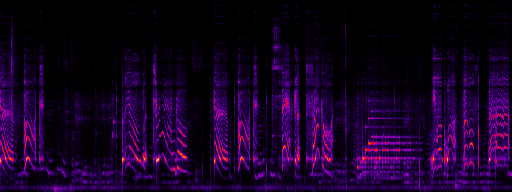

# Spectrogram




## Features

- **Multi-format audio support** (M4A, MP3, WAV, etc.) via FFmpeg
- **Advanced frequency scales** (Linear, Log, Mel, Bark, ERB)
- **Multiple color schemes** (Gray, Inverted Gray, Heat, Inferno)
- **Intensity mapping options** (Linear, Log, Power, Sqrt, Sigmoid)
- **Window functions** (Hanning, Hamming, Blackman, Rectangular)
- **Configurable FFT parameters** (FFT size, hop size)
- **Long audio handling** (automatic splitting and stitching)
- **Metadata extraction** (timestamps, location, device info)

## Installation

```bash
npm install
```

## Usage

```bash
# Basic usage
npm run start "audio-file.m4a"

# With options
npm run start "audio-file.m4a" -- --max-freq 8000 --color heat --scale mel
```

### Key Options

- `--max-freq <hz>` - Maximum frequency to display
- `--min-freq <hz>` - Minimum frequency to display  
- `--color <preset>` - Color scheme (gray, invgray, heat, inferno)
- `--scale <type>` - Frequency scale (linear, log, mel, bark, erb)
- `--mapping <type>` - Intensity mapping (linear, log, power, sqrt, sigmoid)
- `--window <type>` - Window function (hanning, hamming, blackman, rectangular)
- `--fft-size <size>` - FFT size in samples (default: 2048)
- `--hop-size <size>` - Hop size in samples (default: 512)
- `--height <height>` - Spectrogram height in pixels (default: 768)
- `--pixels-per-second <pps>` - Pixels per second for width (default: 96)
- `--min-db <db>` - Minimum dB for color mapping (default: auto)
- `--max-db <db>` - Maximum dB for color mapping (default: auto)
- `-o, --output <file>` - Output PNG file path

## Configuration

The `src/constants.ts` file contains all default parameters and configuration values:

- **DB_CONSTANTS**: Decibel ranges and thresholds for visualization
- **FFT_CONSTANTS**: FFT analysis parameters (size, hop size)
- **WINDOW_CONSTANTS**: Window function coefficients
- **RENDERING_CONSTANTS**: Canvas and rendering limits
- **DEFAULTS**: Default values for all command-line options
- **VALID_OPTIONS**: Available choices for enum-based options

Modify these constants to customize default behavior without changing the source code.

## Output

- `filename.png` - Single spectrogram (short audio)
- `filename_overview.png` - Overview of entire audio
- `filename_part1.png`, `filename_part2.png` - Detailed parts (long audio)
- `filename_stitched.png` - Combined detailed parts
- `filename.meta.json` - Extracted audio metadata

